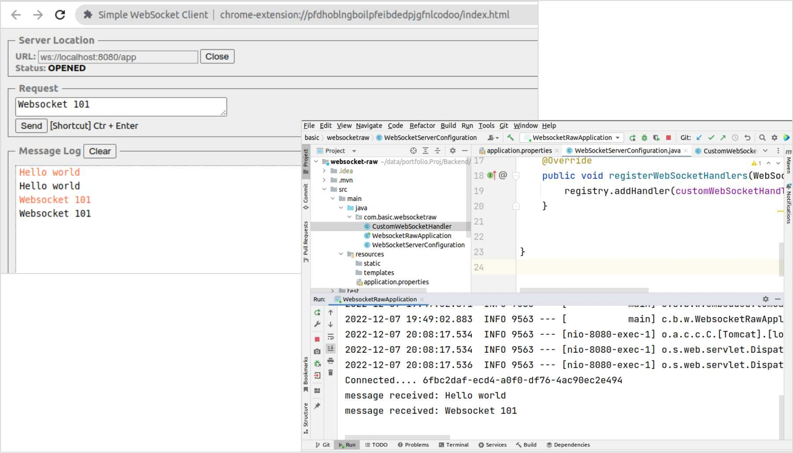

# Spring Boot WebSocket Raw Text Server

Spring WebSocket server without any message layer such as STOMP

## About Project

```text
Framework    : Spring Boot 2.7.5
Java         : Java 11
Build system : Maven
```


## Spring Boot Implementation



1. Library dependency (pom.xml)
   ```xml
     <dependency>
         <groupId>org.springframework.boot</groupId>
         <artifactId>spring-boot-starter-websocket</artifactId>
     </dependency>
   ```

2. Create a class that extends `org.springframework.web.socket.handler.TextWebSocketHandler`
   ```java
   @Component
   public class CustomWebSocketHandler extends TextWebSocketHandler {
    //override lifecycle methods
   }
   ```


3. Register the class in WebSocketHandler Registry that is defined in a configuration class
   ```java
   @Configuration
   @EnableWebSocket
   public class WebSocketServerConfiguration implements WebSocketConfigurer {
      // inject the websocket handler class
      // add the handler to websocket registry by overriding registerWebSocketHandlers method
   }
   ```
   - Add a context path
   - Set CORS origins

## WebSockets 101

```
                                                  +------------------+
                                                  |                  |
                                                  |                  |
+---------------------------+                     |                  |
|                           |                     |                  |
|     WebSocket Client      +---------------------+                  |
|                           |                     |    WebSocket     |
| ws://localhost:8080/app   |                     |      Server      |
|                           +---------------------+                  |
|                           |   HTTP UPGRADE      |                  |
|                           |                     |                  |
+---------------------------+                     |                  |
                                                  |                  |
                                                  +------------------+
```
- A Layer-7 protocol that provides full-duplex, asynchronous message channel
- Existing HTTP connection is converted to WebSocket using `UPGRADE` HTTP header
- `ws` and `wss` URI schemes corresponding to websocket and websocket-secure connections
- [RFC 6455](https://www.rfc-editor.org/rfc/rfc6455)


## References

- [Spring websocket without stomp or sockjs](https://stackoverflow.com/a/32267452)
- [Send message to specific client](https://stackoverflow.com/questions/24073987/how-to-send-message-to-a-specific-device-by-spring-websocket)
